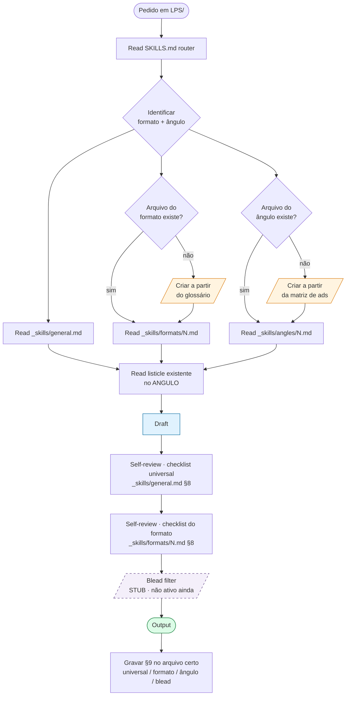

# LPS · SKILLS (router)

> **Função deste arquivo:** ponto de entrada. Não contém aprendizados — só roteia onde encontrá-los. Antes de qualquer edit em `LPS/`, ler este arquivo, depois carregar o(s) arquivo(s) específico(s) do formato + ângulo do listicle em questão. No fim da sessão, gravar aprendizados nos arquivos certos (não aqui).

---

## Pipeline visual

**Legenda:**
- 🟦 Draft — onde o output é produzido.
- 🟧 Criação on-demand — só quando começamos formato/ângulo novo.
- 🟪 Blead filter — stub presente (`_skills/_review/blead-filter.md`), ainda não ativo no fluxo. Quando ativar, vira gate obrigatório antes do output.
- 🟩 Output — entregue ao usuário.

## Protocolo de narração dos gates

Durante a produção, eu narro em uma linha qual gate estou passando, pra você ver o pensamento sem abrir arquivo. Formato: `gate: <nome curto> · <ação>`.

Exemplos:
- `gate: router · identificado formato 03, ângulo 1`
- `gate: skills · carregando general + formats/03 + angles/angulo-1`
- `gate: draft · escrevendo razão #4 (cortisol pillar)`
- `gate: review universal · 8/9 itens ok · falta quote-bridge`
- `gate: review formato · teaser do H1 ausente · corrigindo`
- `gate: blead · pulado (stub não ativo)`
- `gate: aprendizado · gravando em formats/03 §9`

Narração só pra gates **passados** ou **bloqueados**. Não narrar deliberação interna.

---

## Fluxo obrigatório antes de qualquer output

1. **Ler `_skills/general.md`** — identidade visual estrita, pitch, stack, anti-padrões universais.
2. **Identificar formato** do listicle pela tabela §1 abaixo → ler `_skills/formats/<n>-<slug>.md` correspondente.
3. **Identificar ângulo** pela tabela §2 → ler `_skills/angles/angulo-<n>-<slug>.md` correspondente.
4. **Ler o(s) listicle(s) já existentes** no `ANGULO` que estou tocando — fonte da verdade visual.
5. **Validar contra o checklist universal** em `_skills/universal-ordering-checklist.md` antes de marcar como pronto.
6. **Blead filter** — `_skills/_review/blead-filter.md`. **Stub: pular gate até ativarmos.** Quando ativarmos, vira passagem obrigatória.
7. **No fim:** gravar aprendizados na seção §9 do arquivo de formato (se aprendizado for sobre o formato) E/OU §9 do arquivo de ângulo (se for sobre o ângulo). Não escrever aprendizados em SKILLS.md.

---

## §1 · Catálogo de formatos validados

Origem: `Glossario de Formatos - Listicles e Advertoriais DR.docx`. Listo todos os 12 formatos do glossário; arquivo dedicado em `_skills/formats/` existe **só** para formatos que já produzimos. Quando começarmos um formato novo, criar o arquivo a partir do glossário antes de codar.

| #  | Formato                          | Quando usar                                    | Benchmark        | Arquivo skill                       |
|----|----------------------------------|------------------------------------------------|------------------|-------------------------------------|
| 01 | X Reasons / Why Switched         | Lead médio-consciente, já buscou soluções      | First Day        | _ainda não produzido_               |
| 02 | Comparison Matrix Listicle       | Lead consciente vs concorrente direto          | Beltwell · BnB   | [`formats/02-comparison-matrix.md`](_skills/formats/02-comparison-matrix.md) |
| 03 | Reverse Order (#N → #1)          | Quebra de monotonia + reveal do melhor         | First Day        | [`formats/03-reverse-order.md`](_skills/formats/03-reverse-order.md) |
| 04 | Problem-First Narrative          | Lead emocional, dor íntima, 60+                | Everdries · Down To Ground | [`formats/04-problem-first-narrative.md`](_skills/formats/04-problem-first-narrative.md) |
| 05 | Benefit-Stack (Advantages)       | Produto novo, lead frio, tom leve              | Clean Nutra      | _ainda não produzido_               |
| 06 | Feature-Mechanism                | Produto técnico/premium, lead racional         | Shop Novalift    | _ainda não produzido_               |
| 07 | "Why Am I Still X?" Advertorial  | Lead que já tentou e falhou                    | Quiet Lab        | _ainda não produzido_               |
| 08 | Expert Journey Narrative         | Storytelling emocional, avatar feminino        | SP Nutrition     | _ainda não produzido_               |
| 09 | Industry Exposé / Check Bottle   | Lead cético, raiva de indústria                | SP Nutrition ADV1| _ainda não produzido_               |
| 10 | 30-Day Test Diary (Editorial)    | Avatar 55+, news-style, trust via mídia        | Miracle Brand    | _ainda não produzido_               |
| 11 | Timeline-of-Results              | Público que precisa prova progressiva          | mbg / Miracle    | _ainda não produzido_               |
| 12 | PAS Listicle (Pain-Agitate-Solve)| Universal — chassi interno de qualquer item    | Universal        | _ainda não produzido_               |
| **13** | **Symptom Transformation Stories** ⭐ custom Slip | Brand-led, dor multi-sintoma, before/after testimonial-driven | Sofyre + Beltwell + F11 (híbrido) | [`formats/13-symptom-transformation-stories.md`](_skills/formats/13-symptom-transformation-stories.md) |

## §2 · Catálogo de ângulos da Slip

Origem: `leva matriz de ads (1).pdf`. Cada ângulo tem 3 ads UGC validados na matriz que servem de fonte primária do tom, vilão, hook e overlays.

| Ângulo | Nome              | Vetor de persuasão                                       | Big idea unificadora                | Ads na matriz       | Arquivo skill                                      |
|--------|-------------------|----------------------------------------------------------|-------------------------------------|---------------------|---------------------------------------------------|
| 1      | Problema de sono  | Reconhecimento da dor → promessa fisiológica/reframe     | Magnésio Inteligente                | 1.1 / 1.2 / 1.3     | [`angles/angulo-1-problema-de-sono.md`](_skills/angles/angulo-1-problema-de-sono.md) |
| 2      | Cortisol alto     | Vilão fisiológico unificador                             | Detox de cortisol de 15 dias        | 2.1 / 2.2 / 2.3     | _ainda não produzido_                              |
| 3      | Alternativas falhas | Comparação direta com melatonina e magnésio de farmácia | "Não é você, é o que te ofereceram" | 3.1 / 3.2 / 3.3     | [`angles/angulo-3-alternativas-falhas.md`](_skills/angles/angulo-3-alternativas-falhas.md) |

> **Cross-pollination:** um listicle pode ter um ângulo PRIMÁRIO mas usar elementos dos outros como reasons de apoio (ex.: `ANGULO1/listicle-a.html` é Ângulo 1 mas usa cortisol no reason #4 e melatonina no H1). Sempre nomear o ângulo PRIMÁRIO; reasons emprestados de outros ângulos referenciam os arquivos de ângulo correspondentes.

## §3 · Estratégia atual: Scaled Product-Led (Gruns model)

⚠️ **A abordagem 1-listicle-por-ângulo está DEPRIORIZADA.** Estratégia vigente: 5 listicles core curtos product-first, baseados nos top 5 escalados da Gruns. Ver [`_skills/strategy/scaled-product-led.md`](_skills/strategy/scaled-product-led.md) pra tese completa.

**Refs Gruns analisadas:**
- [`refs/gruns/01-fiber.md`](_skills/refs/gruns/01-fiber.md) — 6 itens numerados c/ eyebrow caps. Ref para `CORE/01-magnesio.html`.
- [`refs/gruns/02-protein.md`](_skills/refs/gruns/02-protein.md) — 5 itens c/ Shop Now inline por item. Ref para `CORE/02-vs-melatonina.html`.
- [`refs/gruns/03-nutrition-support.md`](_skills/refs/gruns/03-nutrition-support.md) — 7 itens audience-targeted (cheeky tom). Ref para `CORE/03-viral-tiktok.html`.
- [`refs/gruns/04-weight-loss-journey.md`](_skills/refs/gruns/04-weight-loss-journey.md) — 6 itens journey-anchored + timeline 5 fases. Ref para `CORE/04-emagrecer-desinchar.html`.
- [`refs/gruns/05-first-order.md`](_skills/refs/gruns/05-first-order.md) — Main lander section-based (não listicle). Ref para `CORE/05-main-lander.html`.

## §4 · Catálogo UX (display + responsividade)

Camada transversal de mecânica de display (breakpoints, escalas, container, sticky, mobile). Não duplica `_skills/general.md` (que é identidade de marca). Carregar quando a referência tiver patterns de UX que merecem virar regra.

| Arquivo                                              | Cobre                                                   |
|------------------------------------------------------|---------------------------------------------------------|
| [`ux/general.md`](_skills/ux/general.md)             | Breakpoints, container widths, type scale, espaçamento, tabela comparativa, sticky, header padrões, mobile. |

## §4 · Mapa atual `LPS/`

| Arquivo                              | Formato                  | Ângulo primário      | Referência              | Status         |
|--------------------------------------|--------------------------|----------------------|-------------------------|----------------|
| `ANGULO1/listicle-a.html`            | 03 Reverse Order         | 1 Problema de sono   | First Day               | em iteração    |
| `ANGULO3/listicle-a.html`            | 02 Comparison Matrix     | 3 Alternativas falhas (vs melatonina + magnésio comum) | Balls N'Brains          | em iteração    |
| `ANGULO3/listicle-b.html`            | 04 Problem-First Narrative | 3 Alternativas falhas (foco dependência) | Everdries · Down To Ground | em iteração    |
| `ANGULO3/listicle-c.html`            | 13 Symptom Transformation Stories | 3 Alternativas falhas (testimonial-led, antes/durante/depois) | Sofyre + Beltwell + F11 (híbrido) | em iteração    |

Atualizar esta tabela ao criar/promover qualquer listicle.

## §5 · Onde gravar aprendizado novo

- Aprendizado sobre **stack/identidade visual/pitch** universal → `_skills/general.md` §9.
- Aprendizado sobre **um formato específico** → arquivo do formato §9.
- Aprendizado sobre **um ângulo específico** → arquivo do ângulo §9.
- Aprendizado sobre **UX/display** (breakpoints, type scale, sticky, comportamento mobile) → `_skills/ux/general.md` §10.
- Aprendizado sobre **ordenação universal de itens** → `_skills/universal-ordering-checklist.md` §9 (criar quando primeiro listicle não-Reverse for produzido).
- Aprendizado vindo de **Blead review** → `_skills/_review/blead-filter.md` §9.
- Se o aprendizado se aplica a múltiplos lugares: gravar no mais específico e referenciar nos outros (`ver formats/02-comparison-matrix.md §9 entrada YYYY-MM-DD`).

## §6 · Quando criar arquivo novo

- Começamos formato novo → copiar template do glossário, criar `_skills/formats/<n>-<slug>.md`, atualizar §1.
- Começamos ângulo novo → copiar template da matriz de ads, criar `_skills/angles/angulo-<n>-<slug>.md`, atualizar §2.
- Estudamos referência nova com UX patterns que viram regra → adicionar à `_skills/ux/general.md` ou criar `_skills/ux/<contexto>.md` se for grande demais.
- Não criar arquivo "preventivamente". Só ao começar produção real ou capturar aprendizado real.
